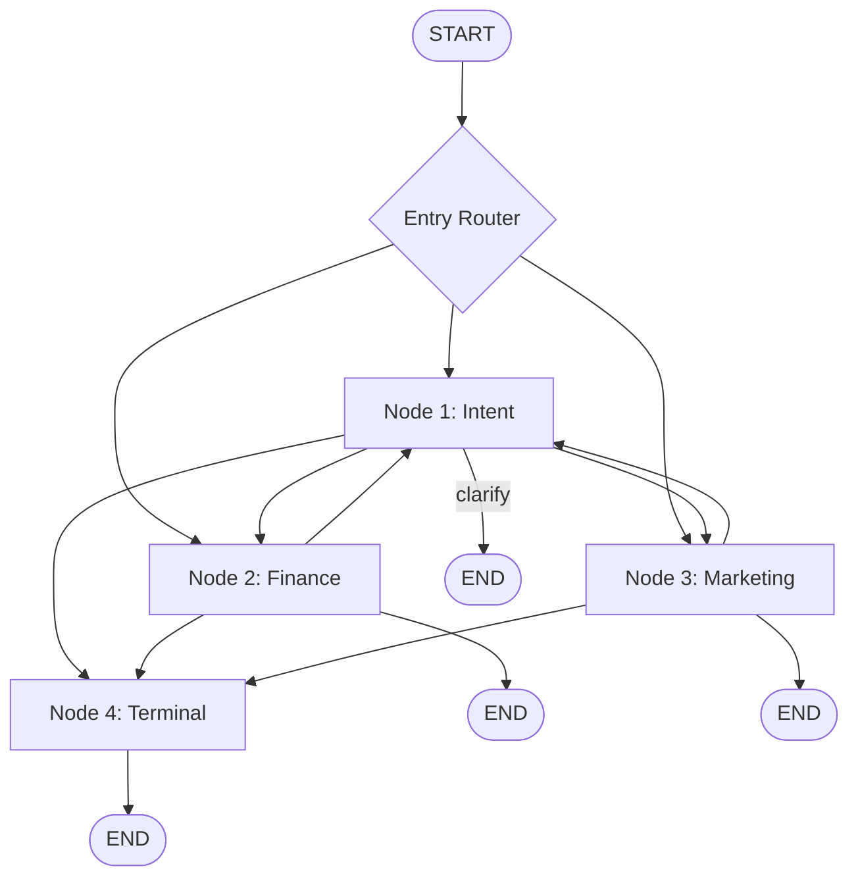

# Multi-Domain Conversational Analytics Copilot (v2)

Production-grade conversational AI copilot with a **FastAPI + LangGraph** backend and **React + TypeScript** frontend. Routes users between isolated **Finance** and **Marketing** domain workers via a 4-node DAG.

## Documentation

| Guide | Description |
|-------|-------------|
| [docs/README.md](./docs/README.md) | Documentation index |
| [docs/SETUP.md](./docs/SETUP.md) | Installation, configuration, and troubleshooting |
| [docs/ARCHITECTURE.md](./docs/ARCHITECTURE.md) | 4-node DAG, state machine, routing, and flows |
| [docs/API.md](./docs/API.md) | Full API reference with SSE protocol and code examples |
| [docs/DATABASE.md](./docs/DATABASE.md) | Database schemas, seed data, and CRUD operations |
| [backend/README.md](./backend/README.md) | Backend quick start |

## Quick Start

### Backend

```powershell
cd "c:\Users\Mayank Dahotre\Desktop\CogitX\chat api\v2\backend"

python -m venv venv
.\venv\Scripts\activate

pip install -r requirements.txt

copy .env.example .env

python -m uvicorn app.main:app --reload --host 127.0.0.1 --port 8000
```

### Frontend

```powershell
cd frontend
npm install
npm run dev
```

- **API docs:** http://localhost:8000/docs
- **Web UI:** http://localhost:5173
- **Run demo:** `python demo.py` (from `backend/`)
- **Terminal chat:** `python chat_cli.py` (from `backend/`)

## Architecture at a Glance

See [docs/ARCHITECTURE.md](./docs/ARCHITECTURE.md) for full LangGraph flow charts.



| Node | Role | Database |
|------|------|----------|
| **Node 1 — Intent** | Classifies and routes user intent | `app_storage.db` |
| **Node 2 — Finance** | Financial statements, COGS, revenue | `finance_data.db` |
| **Node 3 — Marketing** | Campaign metrics, CAC, LTV, ROAS | `marketing_data.db` |
| **Node 4 — Terminal** | Session wrap-up | `app_storage.db` |

## API Endpoints

| Method | Path | Description |
|--------|------|-------------|
| `POST` | `/api/v1/chat/stream` | SSE streaming chat |
| `POST` | `/api/v1/chat/reset` | Reset conversation |
| `GET` | `/api/v1/chat/sessions` | Session history |
| `GET` | `/api/v1/health` | Health check |

## Example

```bash
curl -N -X POST http://localhost:8000/api/v1/chat/stream \
  -H "Content-Type: application/json" \
  -d '{"message": "Give me a financial statement table."}'
```

## Project Layout

```
v2/
├── backend/           # Python FastAPI + LangGraph API
│   ├── app/
│   │   ├── api/       # FastAPI routers
│   │   ├── chat/      # LangGraph DAG, nodes, SSE streaming
│   │   ├── crud/      # Domain-specific data access
│   │   ├── database/  # 3 isolated SQLite connections + seed data
│   │   ├── config.py
│   │   └── main.py
│   ├── data/          # SQLite databases (auto-created)
│   ├── chat_cli.py    # Interactive terminal chat client
│   ├── demo.py        # End-to-end demo script
│   └── requirements.txt
├── frontend/          # React + TypeScript chat UI (Vite)
│   └── src/
├── docs/              # Full documentation (incl. LangGraph flow charts)
└── README.md
```

## Tech Stack

**Backend:** FastAPI · LangGraph · LangChain Core · aiosqlite · Pydantic · SSE  
**Frontend:** React · TypeScript · Vite


