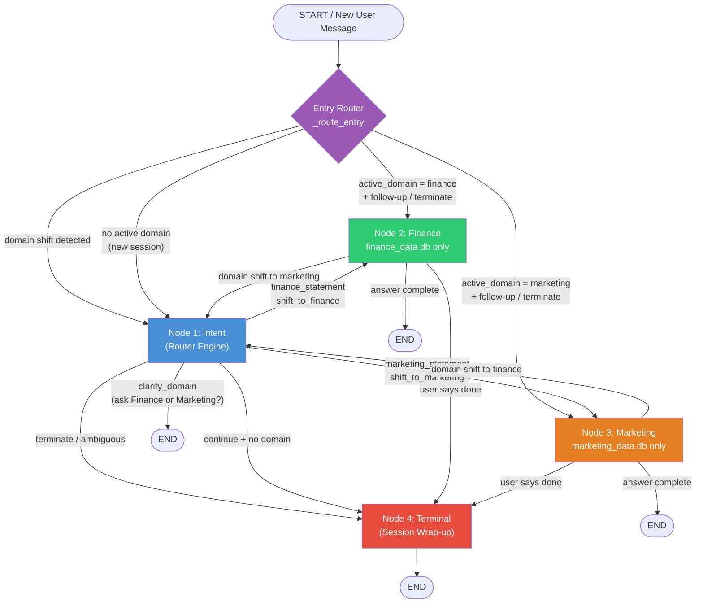
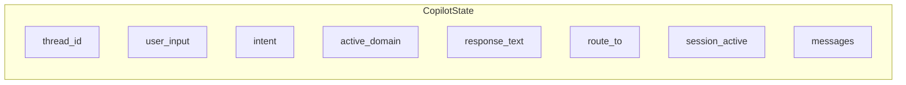

# Architecture

## Overview

The system implements a **Stateful Multi-Agent Directed Acyclic Graph (DAG)** with isolated domain engines. A single SSE streaming endpoint drives all conversation, while a LangGraph state machine routes each message through one of four specialized nodes.

**Stack:** FastAPI · LangGraph · LangChain Core · aiosqlite · Server-Sent Events

---

## 4-Node Topology

### LangGraph Flow Chart (single message turn)

Defined in `app/chat/graph.py` and compiled as `copilot_graph`.



### Self-Loop Across Turns (Node 2 → 2, Node 3 → 3)

Self-loops happen via the **entry router** on the *next* message, not inside the same graph run:

```mermaid
flowchart LR
    T1["Turn 1: 'Give me a statement'"] --> INTENT1[Intent]
    INTENT1 -->|"clarify"| ASK["Ask: Finance or Marketing?"]
    ASK --> T2["Turn 2: 'Finance'"]
    T2 --> ENTRY2{Entry Router}
    ENTRY2 --> INTENT2[Intent]
    INTENT2 --> FIN[Finance Node]
    FIN --> T3["Turn 3: 'Why is COGS high in Q2?'"]
    T3 --> ENTRY3{Entry Router}
    ENTRY3 -->|"active_domain=finance<br/>follow-up detected"| FIN2[Finance Node]
    FIN2 --> T4["Turn 4: 'Show marketing instead'"]
    T4 --> ENTRY4{Entry Router}
    ENTRY4 -->|"shift detected"| INTENT4[Intent]
    INTENT4 --> MKT[Marketing Node]
```



### ASCII Overview

```
                    ┌─────────────────────────────────────┐
                    │           ENTRY ROUTER              │
                    │  (conditional start based on        │
                    │   active_domain in session)         │
                    └──────────┬──────────┬───────────────┘
                               │          │
              active domain    │          │  new session
              = finance        │          │  or domain shift
              = marketing      │          │
                               ▼          ▼
                    ┌──────────────┐  ┌──────────────┐
                    │   Node 2     │  │   Node 1     │
                    │   FINANCE    │  │   INTENT     │
                    │              │  │  (Router)    │
                    └──────┬───────┘  └──────┬───────┘
                           │                 │
                           │    ┌────────────┼────────────┐
                           │    ▼            ▼            ▼
                           │ ┌────────┐ ┌────────┐ ┌──────────┐
                           │ │ Node 2 │ │ Node 3 │ │  Node 4  │
                           │ │Finance │ │Market- │ │ Terminal │
                           │ └────────┘ │  ing   │ └────┬─────┘
                           │            └────────┘      │
                           │                 ▲         ▼
                           └──── self-loop ──┘        END
                             (next turn entry)
```

### Node 1 — Intent (Router Engine)

**File:** `app/chat/nodes/intent_node.py`

- Universal gateway for new sessions and cross-domain shifts
- Classifies user input into explicit intent tracks
- Only node with structural pathway to Terminal for ambiguous input

| Intent | Routes To |
|--------|-----------|
| `clarify_domain` | END (asks Finance or Marketing?) |
| `finance_statement` | Node 2 (Finance) |
| `marketing_statement` | Node 3 (Marketing) |
| `shift_to_finance` | Node 2 (Finance) |
| `shift_to_marketing` | Node 3 (Marketing) |
| `terminate` | Node 4 (Terminal) |
| `ambiguous` | Node 4 (Terminal) |
| `continue` | Active domain node |

### Node 2 — Finance (Isolated Data Layer)

**File:** `app/chat/nodes/finance_node.py`  
**Database:** `finance_data.db` (exclusive access)

- Activated for financial statements, revenue, COGS, balance sheets
- Injects markdown financial statement tables from CRUD layer
- Self-loops on follow-up finance questions (via entry router on next turn)
- Pivots to Node 1 on marketing domain shift
- Routes to Node 4 on session termination

### Node 3 — Marketing (Isolated Data Layer)

**File:** `app/chat/nodes/marketing_node.py`  
**Database:** `marketing_data.db` (exclusive access)

- Activated for campaign performance, CAC, LTV, ROAS, CTR
- Injects markdown marketing metrics tables from CRUD layer
- Self-loops on follow-up marketing questions
- Pivots to Node 1 on finance domain shift
- Routes to Node 4 on session termination

### Node 4 — Terminal (Session Demolition Engine)

**File:** `app/chat/nodes/terminal_node.py`

- Triggered on ambiguous/unrelated input (from Intent) or explicit session end
- Deactivates session in `app_storage.db`
- Pipes execution to graph boundary `END`

---

## State Machine (`CopilotState`)

**File:** `app/chat/state.py`

```python
class CopilotState(TypedDict):
    messages: list[BaseMessage]   # LangChain message history (accumulated)
    thread_id: str                # Conversation thread UUID
    user_input: str               # Current user message
    intent: IntentType            # Classified intent
    active_domain: DomainType     # "finance" | "marketing" | None
    response_text: str            # Generated response for SSE streaming
    route_to: str                 # Next node routing key
    session_active: bool          # Whether session is still open
```

### State Flow Between Nodes



---

## Routing Logic

### Entry Router (`_route_entry`)

On each new user message, the graph entry point is conditional:

| Condition | Entry Node |
|-----------|------------|
| `active_domain == "finance"` and follow-up/terminate | Finance |
| `active_domain == "finance"` and domain shift | Intent |
| `active_domain == "marketing"` and follow-up/terminate | Marketing |
| `active_domain == "marketing"` and domain shift | Intent |
| No active domain | Intent |

This implements the **Node 2 → Node 2** and **Node 3 → Node 3** self-loop semantics across conversation turns without infinite in-graph loops.

### Intent Classification

**File:** `app/chat/intent.py`

Uses regex-based keyword matching (no LLM required):

| Pattern Group | Keywords |
|---------------|----------|
| Finance (specific) | `finance`, `revenue`, `cogs`, `balance sheet`, `net income`, `ledger`, `p&l` |
| Marketing (specific) | `marketing`, `cac`, `ltv`, `roas`, `ctr`, `campaign`, `acquisition` |
| Generic statement | `financial statement`, `give me a table`, `show me a report` → triggers **clarify_domain** |
| Domain choice | `Finance`, `Marketing`, `1`, `2` (after clarification) |
| Terminate | `done`, `thank you`, `goodbye`, `no more questions` |
| Follow-up | `why`, `how`, `what`, `explain`, `q1`–`q4`, `trend`, `breakdown` |

### Intent Node Decision Table

| Classified Intent | Next Node | Example User Message |
|-------------------|-----------|----------------------|
| `clarify_domain` | END (with question) | "Give me a financial statement" |
| `finance_statement` | Finance | "Finance" / "Show me revenue" |
| `marketing_statement` | Marketing | "Marketing" / "Show me CAC" |
| `shift_to_finance` | Finance | Switch from marketing session |
| `shift_to_marketing` | Marketing | Switch from finance session |
| `terminate` | Terminal | "I'm done, thank you" |
| `ambiguous` | Terminal | Unrelated input |

---

## Conversation Flow Scenarios

### Flow A — Clarify → Finance → Follow-up

```
Turn 1: "Give me a financial statement table."
  START → Entry → Intent → END          (clarification question)

Turn 2: "Finance"
  START → Entry → Intent → Finance → END

Turn 3: "Why is COGS high in Q2?"
  START → Finance (self-loop entry) → END
```

### Flow B — Dynamic Mid-Session Context Shift

```
Turn 1: (in finance session) "Show me marketing performance instead."
  START → Entry → Intent → Marketing → END
```

Alternative path if already inside Finance node:
```
  Finance → Intent → Marketing → END
```

### Flow C — Session Wrap-Up

```
Turn N: "I am done with all my questions, thank you."
  START → Marketing → Terminal → END
  (session.is_active set to 0)
```

### Example Graph Paths Summary

| Scenario | Graph Path |
|----------|------------|
| Clarify → Finance → Follow-up | `intent → END` → `intent → finance → END` → `finance → END` |
| Domain shift | `finance → intent → marketing → END` |
| Session end | `marketing → terminal → END` |

---

## Data Isolation

```
┌─────────────────────────────────────────────────────────┐
│                    APPLICATION LAYER                     │
│                                                         │
│  ┌─────────────┐  ┌─────────────┐  ┌─────────────────┐ │
│  │  Node 1     │  │  Node 4     │  │  Session CRUD   │ │
│  │  Intent     │  │  Terminal   │  │  (all nodes)    │ │
│  └──────┬──────┘  └──────┬──────┘  └────────┬────────┘ │
│         │                │                   │          │
│         └────────────────┼───────────────────┘          │
│                          ▼                              │
│               ┌─────────────────────┐                     │
│               │  app_storage.db   │                     │
│               │  sessions         │                     │
│               │  messages         │                     │
│               └─────────────────────┘                     │
└─────────────────────────────────────────────────────────┘

┌──────────────────────┐    ┌──────────────────────┐
│      Node 2 ONLY     │    │      Node 3 ONLY     │
│  ┌────────────────┐  │    │  ┌────────────────┐  │
│  │ finance_data.db│  │    │  │marketing_data.db│ │
│  │ financial_     │  │    │  │ campaign_      │  │
│  │   statements   │  │    │  │   metrics      │  │
│  │ balance_sheet  │  │    │  └────────────────┘  │
│  └────────────────┘  │    └──────────────────────┘
└──────────────────────┘
```

Finance CRUD (`app/crud/finance.py`) only imports `get_finance_connection`.  
Marketing CRUD (`app/crud/marketing.py`) only imports `get_marketing_connection`.  
No cross-domain database imports exist in the codebase.

---

## SSE Streaming Pipeline

**File:** `app/chat/sse.py`

```
User HTTP POST
      │
      ▼
stream_chat() async generator
      │
      ├── ensure_session()          → app_storage.db
      ├── save_message(user)        → app_storage.db
      ├── copilot_graph.astream()   → LangGraph DAG execution
      ├── tokenize response         → chunk into SSE tokens
      ├── save_message(assistant)   → app_storage.db
      └── yield SSE events
```

### SSE Event Types

| Type | When Emitted | Payload |
|------|--------------|---------|
| `start` | Stream begins | `thread_id` |
| `token` | Each text chunk | `content` (partial response) |
| `metadata` | After graph completes | `nodes` (visited path), `thread_id` |
| `done` | Stream ends | — |
| `error` | Session ended / failure | `content` (error message) |

---

## Module Layout

```
backend/app/
├── main.py                 # FastAPI app factory + lifespan
├── config.py               # Settings from .env
├── api/
│   └── chat.py             # HTTP endpoints
├── chat/
│   ├── graph.py            # LangGraph DAG definition
│   ├── state.py            # CopilotState TypedDict
│   ├── intent.py           # Keyword intent classifier
│   ├── sse.py              # SSE streaming wrapper
│   └── nodes/
│       ├── intent_node.py
│       ├── finance_node.py
│       ├── marketing_node.py
│       └── terminal_node.py
├── crud/
│   ├── app_session.py      # Session + message persistence
│   ├── finance.py          # Finance domain queries
│   └── marketing.py        # Marketing domain queries
└── database/
    ├── connections.py      # Per-DB connection factories
    ├── init_db.py          # Schema creation on startup
    └── seed.py             # Dummy seed data
```
